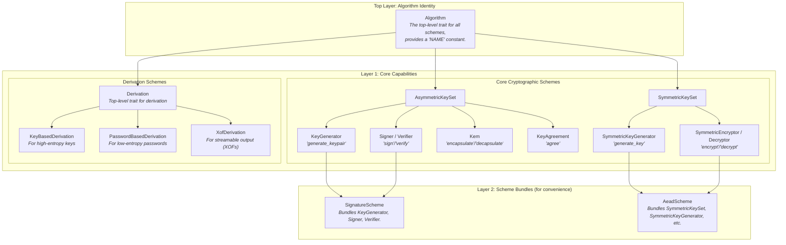
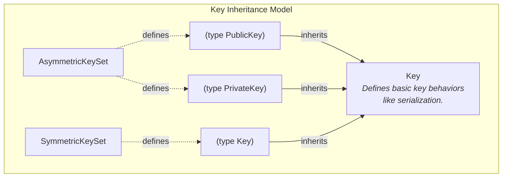

# seal-crypto

[](https://crates.io/crates/seal-crypto)
[](https://docs.rs/seal-crypto)
[](./LICENSE)

`seal-crypto` is the underlying cryptographic engine for the `seal-kit` ecosystem, providing a set of pure, trait-based cryptographic capability abstractions and implementations.

[中文文档 (Chinese Version)](README_CN.md)

## Core Philosophy

`seal-crypto` is designed to be clear, modern, and aligned with Rust API best practices. Its core principles are:

1.  **Trait-Based Abstraction**: The library is built around a set of traits that define fundamental cryptographic operations (e.g., encryption, signing, key generation). This approach cleanly separates the interface (what you want to do) from the implementation (how it's done).
2.  **Modular & Composable**: Specific cryptographic algorithms (like AES, RSA, Kyber) are implemented as independent units that fulfill these traits. Users can enable only the algorithms they need via Cargo features, resulting in a smaller, more focused application.
3.  **Security-First**:
    *   **Memory Safety**: All sensitive data, such as `PrivateKey`, `SymmetricKey`, and `SharedSecret`, are wrapped using the [`zeroize`](https://crates.io/crates/zeroize) crate. This ensures that the memory they occupy is securely wiped when they go out of scope, significantly reducing the risk of key material leakage.
    *   **Explicit Error Handling**: Each cryptographic domain has its own specific, descriptive error types (e.g., `SignatureError`, `KemError`) to allow for clear and robust error handling.
4.  **Ease of Use**: A `prelude` module is provided. A simple `use seal_crypto::prelude::*` brings all essential traits and types into scope, streamlining development.

## Quick Start

Add `seal-crypto` to your `Cargo.toml`. You can enable the `full` feature to include all supported algorithms, or select individual algorithm features as needed.

```toml
[dependencies]
# Enable all features
seal-crypto = { version = "0.1.0", features = ["full"] }

# Or, enable only specific algorithms
# seal-crypto = { version = "0.1.0", features = ["rsa", "aes-gcm", "kyber"] }
```

### Example Usage

Here is a quick example of signing and verifying a message using RSA-4096 with SHA-256.

```rust
use seal_crypto::prelude::*;
use seal_crypto::schemes::asymmetric::traditional::rsa::Rsa4096;
// use seal_crypto::schemes::hash::Sha256;

fn main() -> Result<(), CryptoError> {
    // 1. Define the scheme by key parameters.
    // By default, RsaScheme uses Sha256 as the hash function.
    type MyRsaScheme = Rsa4096;

    // 2. Generate a key pair.
    let (public_key, private_key) = MyRsaScheme::generate_keypair()?;
    println!("Successfully generated RSA-4096 key pair.");

    // 3. Prepare a message and sign it.
    let message = b"This is an important message.";
    let signature = MyRsaScheme::sign(&private_key, message)?;
    println!("Message signed successfully.");

    // 4. Verify the signature.
    MyRsaScheme::verify(&public_key, message, &signature)?;
    println!("Signature verification successful!");

    Ok(())
}
```

For more detailed examples, check out the `examples` directory. You can run them using `cargo`:

```sh
# Run the hybrid encryption example
cargo run --example hybrid_encryption --features "full"

# Run the digital signature example
cargo run --example digital_signature --features "full"
```

## Trait Design Philosophy

The power and clarity of `seal-crypto` come from its layered, consistent, and single-responsibility trait architecture. This design makes the library both easy to use for common tasks and flexible enough for advanced generic programming.

The hierarchy can be visualized as follows:



Here's a breakdown of the layers:

1.  **Top Layer: Algorithm Identity (`Algorithm`)**: This is the unified top-level trait for all cryptographic schemes.
2.  **Layer 1: Core Capabilities**: This layer is the heart of the library, linking scheme sets like `AsymmetricKeySet` to their capability traits (`Signer`, `Kem`, etc.).
3.  **Layer 2: Scheme Bundles**: For user convenience, we provide "supertraits" like `SignatureScheme` that bundle relevant capabilities.

This layered approach ensures that every trait has a clear purpose. The detailed key inheritance model is shown in the next diagram.

### Key Inheritance Detail

To keep the main diagram clean, the relationship between scheme sets, their associated key types, and the base `Key` trait is detailed below. This illustrates how the specific keys used by a scheme are defined and how they build upon the fundamental `Key` primitive.



This layered approach ensures that every trait has a clear purpose, preventing ambiguity and making the entire library highly consistent and predictable.

## Supported Algorithms

| Capability | Algorithm | Cargo Feature |
| :--- | :--- | :--- |
| **Signature** | RSA-PSS (2048/4096 bits, configurable hash) | `rsa`, `sha2`, etc. |
| | ECDSA (P-256) | `ecc` |
| | EdDSA (Ed25519) | `ecc` |
| | Dilithium (2/3/5) | `dilithium` |
| **KEM** | RSA-OAEP (2048/4096 bits, configurable hash) | `rsa`, `sha2`, etc. |
| | Kyber (512/768/1024) | `kyber` |
| **Key Agreement** | ECDH (P-256) | `ecdh` |
| **AEAD** | AES-GCM (128/256 bits) | `aes-gcm` |
| | ChaCha20-Poly1305 | `chacha20-poly1305` |
| **Key Derivation (KDF)** | HKDF (SHA-256, SHA-384, SHA-512) | `hkdf` |
| | PBKDF2 (SHA-256, SHA-384, SHA-512) | `pbkdf2` |
| | SHAKE (128, 256) | `shake` |
| **Password Derivation (PBKDF)** | PBKDF2 (SHA-256, SHA-384, SHA-512) | `pbkdf2` |
| **Hashing** | SHA-2 (256, 384, 512) | `sha2` |

## License

This project is licensed under the Mozilla Public License 2.0 (MPL-2.0).
See the [LICENSE](./LICENSE) file for details. 