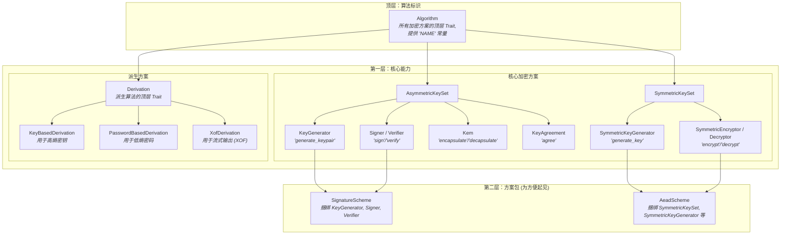
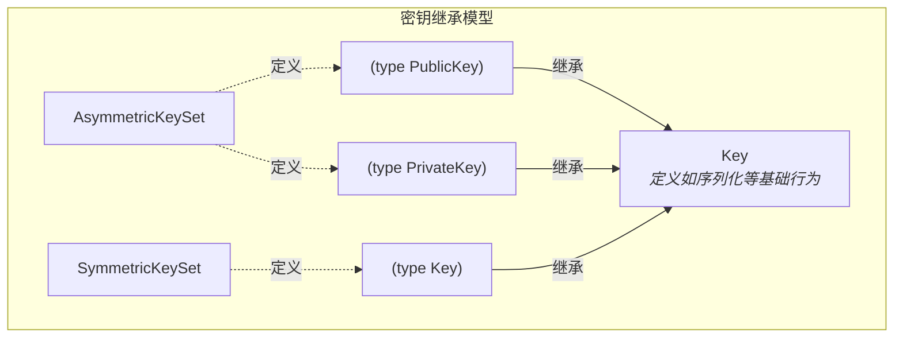

# seal-crypto

[](https://crates.io/crates/seal-crypto)
[](https://docs.rs/seal-crypto)
[](./LICENSE)

`seal-crypto` 是 `seal-kit` 生态系统的底层加密引擎，提供了一套纯粹的、基于 Trait 的加密能力抽象和实现。

[English Version](README.md)

## 设计理念

`seal-crypto` 的设计清晰、现代化，并遵循了 Rust API 设计的最佳实践。其核心理念可以概括为以下几点：

1.  **基于 Trait 的抽象**: 库的核心是围绕一组定义了基本加密操作（如加密、签名、密钥生成）的 `trait` 构建的。这种方法将接口（你想要做什么）与实现（具体用哪种算法做）完全分离。
2.  **模块化和可组合性**: 具体的加密算法（如 AES, RSA, Kyber）作为独立的单元实现这些 `trait`。用户可以通过 Cargo 的 features 来选择性地启用他们需要的算法，从而使最终的程序更小、更专注。
3.  **安全优先**:
    *   **内存安全**: 所有敏感数据，如私钥（`PrivateKey`）、对称密钥（`SymmetricKey`）和共享密钥（`SharedSecret`），都使用 [`zeroize`](https://crates.io/crates/zeroize) 库进行包装。这意味着当这些密钥离开其作用域时，它们占用的内存会被安全地擦除，极大地降低了密钥泄露的风险。
    *   **明确的错误处理**: 每种加密操作都有其专属的、详细的错误类型（如 `SignatureError`, `KemError`），让调用者可以清晰地处理失败情况。
4.  **易用性**: 提供了一个 `prelude` 模块，只需 `use seal_crypto::prelude::*` 就可以方便地导入所有核心的 trait 和类型，简化了开发体验。

## 快速开始

将 `seal-crypto` 添加到你的 `Cargo.toml` 中。你可以启用 `full` 功能来包含所有支持的算法，或者根据需要选择独立的算法功能。

```toml
[dependencies]
# 启用所有功能
seal-crypto = { version = "0.1.0", features = ["full"] }

# 或者，只启用特定算法
# seal-crypto = { version = "0.1.0", features = ["rsa", "aes-gcm", "kyber"] }
```

### 使用示例

以下是一个使用 RSA-4096 和 SHA-256 进行签名和验证的快速示例：

```rust
use seal_crypto::prelude::*;
use seal_crypto::schemes::asymmetric::traditional::rsa::Rsa4096;
// use seal_crypto::schemes::hash::Sha256;

fn main() -> Result<(), CryptoError> {
    // 1. 通过密钥参数来定义方案。
    // RsaScheme 默认使用 Sha256 作为哈希函数。
    type MyRsaScheme = Rsa4096;

    // 2. 生成密钥对。
    let (public_key, private_key) = MyRsaScheme::generate_keypair()?;
    println!("成功生成 RSA-4096 密钥对。");

    // 3. 准备消息并签名。
    let message = b"这是一条重要的消息。";
    let signature = MyRsaScheme::sign(&private_key, message)?;
    println!("消息签名成功。");

    // 4. 验证签名。
    MyRsaScheme::verify(&public_key, message, &signature)?;
    println!("签名验证成功！");

    Ok(())
}
```

我们提供了更详细的示例代码，请查看 `examples` 目录。你可以使用 `cargo` 来运行它们：

```sh
# 运行混合加密示例
cargo run --example hybrid_encryption --features "full"

# 运行数字签名示例
cargo run --example digital_signature --features "full"
```

## Trait 设计哲学

`seal-crypto` 的强大与清晰源于其分层的、一致的、单一职责的 Trait 架构。这种设计使得库既易于完成常见任务，又足够灵活以支持高级的泛型编程。

其层次结构可以可视化如下：



各层解析如下：

1.  **顶层：算法标识 (`Algorithm`)**: 这是所有加密方案的统一顶层 Trait。
2.  **第一层：核心能力**: 这是库的核心，将像 `AsymmetricKeySet` 这样的方案集与其能力 Trait (如 `Signer`, `Kem` 等) 联系起来。
3.  **第二层：方案包**: 为了方便用户，我们提供了像 `SignatureScheme` 这样的"超级 Trait"来捆绑相关的能力。

这种分层方法确保了每个 Trait 都有明确的用途。详细的密钥继承模型见下图。

### 密钥继承详情

为了保持主图的整洁，我们将方案集、其关联密钥类型以及基础 `Key` Trait 之间的关系在此详细说明。下图展示了方案使用的具体密钥是如何被定义，以及它们如何建立在 `Key` 这一基础原语之上。



这种分层的方法确保了每个 Trait 都有其明确的用途，避免了歧义，并使得整个库高度一致和可预测。

## API 概览

API 主要由以下几个核心 `trait` 组成，它们位于 `seal_crypto::traits` 模块下：

-   `KeyGenerator`: 为非对称加密算法生成密钥对。
-   `SymmetricEncryptor` / `SymmetricDecryptor`: 提供对称认证加密（AEAD）功能。
-   `Kem` (Key Encapsulation Mechanism): 用于安全地交换密钥。
-   `KeyAgreement`: 用于密钥协商以生成共享密钥。
-   `Signer` / `Verifier`: 创建和验证数字签名。
-   `Hasher`: 提供哈希摘要功能。
-   `KeyBasedDerivation`: 从高熵输入密钥材料中派生一个或多个安全密钥。
-   `PasswordBasedDerivation`: 从低熵密码中派生一个或多个安全密钥。
-   `XofDerivation`: 从输入密钥材料中派生一个可扩展的字节流 (用于 SHAKE 等 XOF)。

## 支持的算法

| 功能 | 算法 | Cargo Feature |
| :--- | :--- | :--- |
| **签名** | RSA-PSS (2048/4096 位, 可配置哈希) | `rsa`, `sha2`, etc. |
| | ECDSA (P-256) | `ecc` |
| | EdDSA (Ed25519) | `ecc` |
| | Dilithium (2/3/5) | `dilithium` |
| **KEM** | RSA-OAEP (2048/4096 位, 可配置哈希) | `rsa`, `sha2`, etc. |
| | Kyber (512/768/1024) | `kyber` |
| **密钥协商** | ECDH (P-256) | `ecdh` |
| **AEAD** | AES-GCM (128/256 位) | `aes-gcm` |
| | ChaCha20-Poly1305 | `chacha20-poly1305` |
| **密钥派生 (KDF)** | HKDF (SHA-256, SHA-384, SHA-512) | `hkdf` |
| | PBKDF2 (SHA-256, SHA-384, SHA-512) | `pbkdf2` |
| | SHAKE (128, 256) | `shake` |
| **密码派生 (PBKDF)** | PBKDF2 (SHA-256, SHA-384, SHA-512) | `pbkdf2` |
| **哈希** | SHA-2 (256, 384, 512) | `sha2` |

## 许可证

本项目采用 Mozilla Public License 2.0 (MPL-2.0) 授权。
详情请见 [LICENSE](./LICENSE) 文件。 